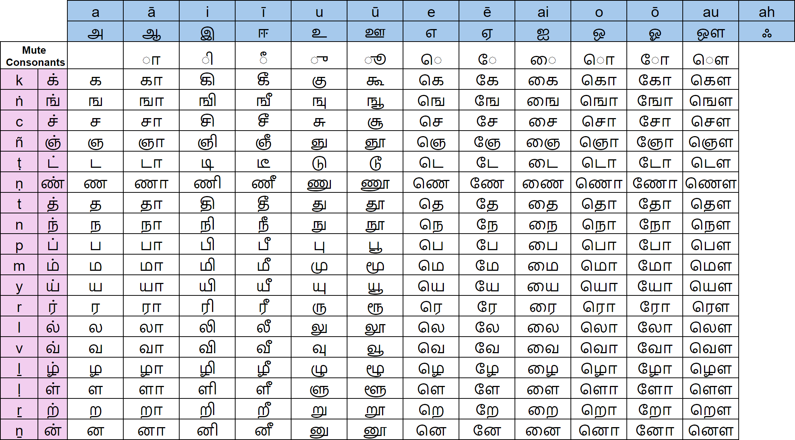
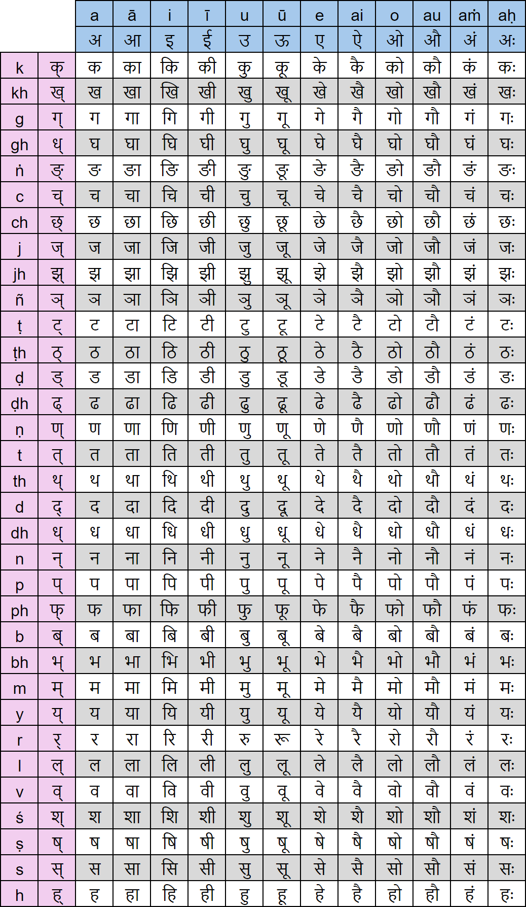
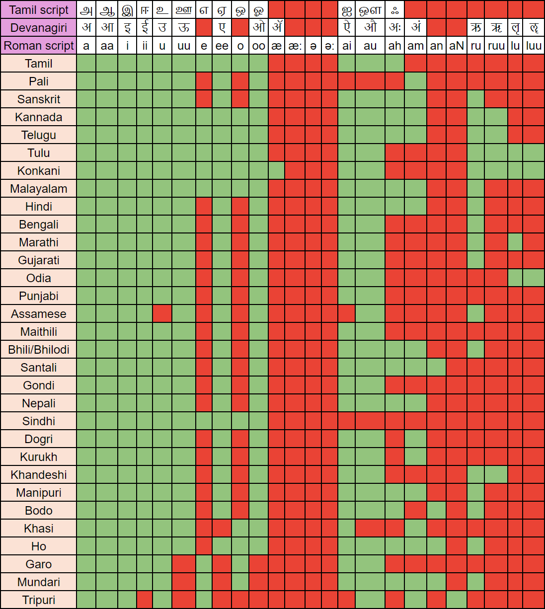
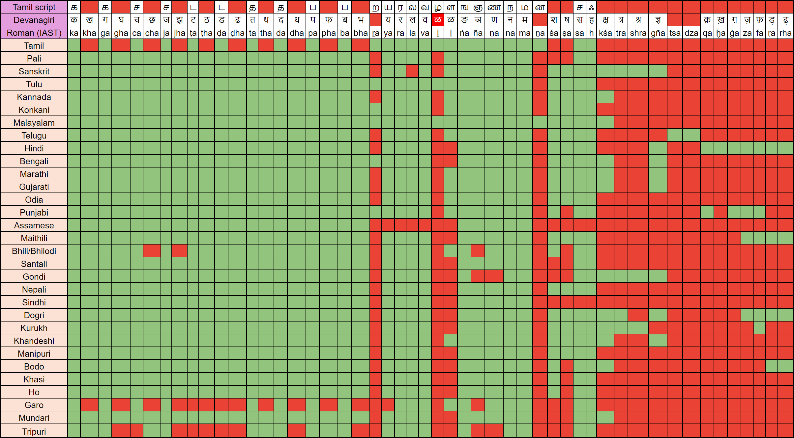

சொற்களஞ்சியம்
==============

நீங்கள் MCTB ஆங்கில பதிப்பை வாசிக்கிறீகள் என்றால், ஆங்கிலத்தில் எழுதப்படும்
தமிழ் மற்றும் பாலி வார்த்தைகளை எவ்வாறு சரியாக உச்சரிக்க வேண்டும் என்பதைப்
புரிந்துகொள்வது அவசியம். நீங்கள் IAST தரத்தைக் கற்றுக்கொண்டால் மட்டுமே அது
சாத்தியமாகும்.

IAST என்பது சங்கதம் மற்றும் தொடர்புடைய பாரத மொழிகளால் பயன்படுத்தப்படும்
பாரத எழுத்துக்களை ஒலி இழப்பின்றி ரோமானியமயமாக்க அனுமதிக்கும் ஒரு
ஒலிபெயர்ப்பு திட்டமாகும். இது பத்தொன்பதாம் நூற்றாண்டில் சார்லஸ் ட்ரெவெலியன்,
வில்லியம் ஜோன்ஸ், மோனியர் மோனியர்-வில்லியம்ஸ் மற்றும் பிற அறிஞர்களின்
பரிந்துரைகளிலிருந்து உருவான ஒரு திட்டத்தை அடிப்படையாகக் கொண்டது மற்றும்
செப்டம்பர் 1894 இல் ஜெனிவா ஓரியண்டல் காங்கிரஸின் ஒலிபெயர்ப்புக் குழுவால்
முறைப்படுத்தப்பட்டது. IAST அசல் பாரத எழுத்தில் இருந்ததைப் போலவே, பாரத
உரையை வாசகருக்கு சந்தேகத்திற்கு இடமின்றி வாசிப்பதை சாத்தியமாக்குகிறது.
பாரத மொழிகளின் ஒலிகளுக்கு IAST கொடுக்கும் துல்லியமே அறிஞர்களிடையே
அதன் தொடர்ச்சியான பிரபலத்திற்கு காரணமாகும்.

ஆனால் அதிலும் தவருகள் உள்ளன. உரோமானிய மொழிகளில் எழுதப்படும் சில
எழுத்துக்களை ஆங்கிலத்தில் உச்சரிக்கயில் சில மாறுபடுத்தல் உண்டு. அவற்றை
விளக்கமாக புரிந்துகொள்ள கீழே கொடுக்கப்பட்டுள்ள படங்களைப் பார்க்கவும்.

பாரத மொழிகள் ஒலிப்பு அடிப்படையிலானவை. தர்க்கரீதியாக சிந்தித்துப் பார்த்தால்,
ஒலிகளே மொழிகளின் மையம் மற்றும் இந்த ஒலிகள் இடம் மற்றும் நேர
எல்லைகளில் கடத்தப்பட வேண்டியிருக்கும் போது எழுத்துமுறை பின்னர் வருகின்றன.

பாரத மொழிகளில் ஒலிகளை பொறிக்க பல்வேறு எழுத்துமுறைகள் இருந்தன. அவற்றில்
முக்கியமானவை பிராமி எழுத்துக்கள் மற்றும் மிகவும் சமீபத்தியது மற்றும்
பெரும்பான்மையானது தேவநாகரி.

எனவே ரோமானிய எழுத்துக்களில் பாரத மொழிகளை எவ்வாறு சர்வதேசமயமாக்குவது
என்பது அடுத்த கேள்வி.

பாரத மொழிகளை ஏன் சர்வதேசமயமாக்க வேண்டும்? வெளிநாட்டவர்கள் பாரத
நூல்களைப் படித்துப் புரிந்துகொள்வதற்கு!! ரோமானிய எழுத்துக்களில் ஏன்? ஏனெனில்
ஐரோப்பியர்கள் புதிய உலக ஒழுங்கை (பிந்தைய காலனித்துவம்) எழுதியுள்ளனர் மற்றும்
ஆங்கிலம் உலகில் பொதுவாகப் பயன்படுத்தப்படும் மொழியாகும். நவீன காலத்தில்
பாரததிற்கு ஒரு பொதுவான எழுத்துமுறை தேவை, தேவநாகரியை சங்கதம்/இந்தி மூலம்
நாம் நிராகரித்துள்ளோம், எனவே அடுத்த தேர்வு ஆங்கில/ரோமானிய எழுத்துக்கள் மட்டுமே.

**IAST இல் தவறு**

IAST என்பது ஆங்கில எழுத்துகளின் சூப்பர்செட் ஆகும், மேலும் இது பாரத மொழி ஒலிகளை
பிரதிநிதித்துவப்படுத்துவதில் ஆங்கிலத்தை விட சிறப்பான பணி செய்கிறது. இருப்பினும் இது
பிராமி அல்லது தேவநாகரி போன்ற பாரத எழுத்துக்களுக்கு இணையானது இல்லை.

தமிழில் `த` என்ற ஒலியை எடுத்துக் கொள்ளுங்கள். இது IAST இல் `T` என எழுதப்படும்.
ஒரு பாமரன் (நம் படித்த தமிழ் மக்கள் உட்பட) Tamil என்பதை `டாமில்` என்று படிக்கிறான்.

ஒலியை எடுத்துக் கொள்ளுங்கள்: मोदी என்ற வார்த்தை IAST இல் Mōdī என்றும் ஆங்கிலத்தில் Modee
என்று எழுதப்பட்டுள்ளது. வெளிநாட்டிலோ அல்லது தமிழ்நாட்டிலோ கூட இந்தி அறிமுகம்
இல்லாத ஒரு சாமானியர் அதை மோடி என்று உச்சரிக்கிறார். தல தோனி ரசிகர்கள்
அனைவருக்கும், 2015க்கு முன் தமிழ் ஊடகங்கள் அவரது பெயரை டோணி என்று எழுதியது
நினைவிருக்கிறதா? தமிழ்நாட்டில் உள்ள அனைவரும் இதைப் படித்திருப்பார்கள். இது
ஊடகத்தின் எழுத்து மற்றும் ஒலிகள் பற்றிய புரிதல் இல்லாதது.

IAST இல் என்ன சரிசெய்ய வேண்டும்?

செய்ய வேண்டிய பல திருத்தங்கள் உள்ளன. ஆனால் குறைந்தபட்சம்:

* `T` மற்றும் `Ṭ` பயன்பாட்டை மாற்றவும். `T` என்றால் `ட/ट` என்றும் `Ṭ` என்றால் `த/त` என்றும் பொருள் கொள்ள வேண்டும்.
* `D` மற்றும் `Ḍ` பயன்பாட்டை மாற்றவும். `D` என்றால் `ட/ड` என்றும் `Ḍ` என்றால் `த/द` என்றும் பொருள் கொள்ள வேண்டும்.
* `G`, `J`, `T`, `D`, `B` ஆகியவற்றிற்கும் இதே மாதிரியான மாற்றங்கள் செய்யப்பட வேண்டும். சொற்களுக்கு நடுவில் இருக்கும் மெல்லிய ஒலிகளை அவை குறிக்க வேண்டும். மாறாக கடுமையான ஒலிகளை குறிக்க பயன்படும் `K`, `C`, `T`, `D`, `P` ஆகிய எழுத்துக்கலால்
எழுதப்படுகின்றன.

இது நடக்குமா என்றெனக்கு தெரியாது, அனால் இது நடந்தேறினால் மிகவும் மகிழ்ச்சி!

**தமிழ் எழுத்துக்கள்**

**தேவநாகரி எழுத்துக்கள்**

**பாரதத்தில் தோன்றிய மொழிகளில் உயிரெழுத்துக்கள்**

இப்பட்டியலில் ஒவ்வொரு மொழியிலும் உயிரெழுத்துக்கள் கொடுக்கப்பட்டுள்ளன.
ஒரு மொழியில் குறிப்பிட்ட உயிரெழுத்துக்களின் இருப்பை பச்சை நிறத்திலும்
இல்லாமையை சிகப்பு நிறத்திலும் குறிப்பிட்டுள்ளேன்.

**பாரதத்தில் தோன்றிய மொழிகளில் மெய்யெழுத்துக்கள்**

இப்பட்டியலில் ஒவ்வொரு மொழியிலும் மெய்யெழுத்துக்கள் கொடுக்கப்பட்டுள்ளன.
ஒரு மொழியில் குறிப்பிட்ட மெய்யெழுத்துக்களின் இருப்பை பச்சை நிறத்திலும்
இல்லாமையை சிகப்பு நிறத்திலும் குறிப்பிட்டுள்ளேன்.

**தமிழ் சொற்கள் மற்றும் அவற்றின் ஆங்கில பொருள்கள்**

ஆங்கிலப் பதிப்பில் பயன்படுத்திய சொற்களிற்கு இந்நூலில் இணையக பயன்படுத்திய தமிழ்ச்
சொற்களை இங்கு வழங்கியுள்ளேன்.

.. list-table:: தமிழ் சொற்களும் அவற்றின் ஆங்கில பொருள்களும்
    :widths: 30 70
    :header-rows: 1
    :stub-columns: 1
    :width: 50%
    :class: glossary

    * - English
      - தமிழ்
    * - Consciousness
      - நனவு
    * - Wisdom
      - ஞானம்
    * - Mindfulness
      - தொடற்நிறைகவனம்
    * - Concentration
      - சமாதி/ஒருங்குநிலை
    * - Insight
      - நுண்ணறிவு
    * - Enlightenment
      - ஞானத்தெளிவு/நிர்வாணம்
    * - Suffering
      - துக்கம்/துயரம்
    * - Information
      - உள்ளுருமம்/தகவல்
    * - Knowledge
      - அறிவு
    * - Conscious perception
      - நனவுக்காட்சி
    * - Inner perception
      - அகப்பார்வை
    * - Reality
      - மெய்நிலை
    * - Impermanence
      - நிலையாமை
    * - Meditation
      - யோகம்/தியானம்
    * - Mind
      - மனம்
    * - Body
      - உடல்
    * - Emotion
      - உணர்வு
    * - Sensation
      - புலனுணர்வு
    * - Sensate Reality
      - புலன்மெய்நிலை
    * - Careful
      - அக்கறையுடன்
    * - Awareness
      - விழிப்புணர்வு/கவனம்
    * - Awakening
      - விழிப்புநிலை
    * - Attention
      - கவனம்
    * - Feeling
      - உணர்வு
    * - Decadence
      - நலிவு
    * - Attachment
      - இணைப்பு
    * - Detachment
      - விலக்கு
    * - Liberation
      - விடுதலை
    * - Rebirth
      - மறுபிறப்பு
    * - Karma
      - கர்மம்/வினை
    * - Theravada
      - தேரவாதம்
    * - Vipassanā
      - நுழைபுலதியானம்
